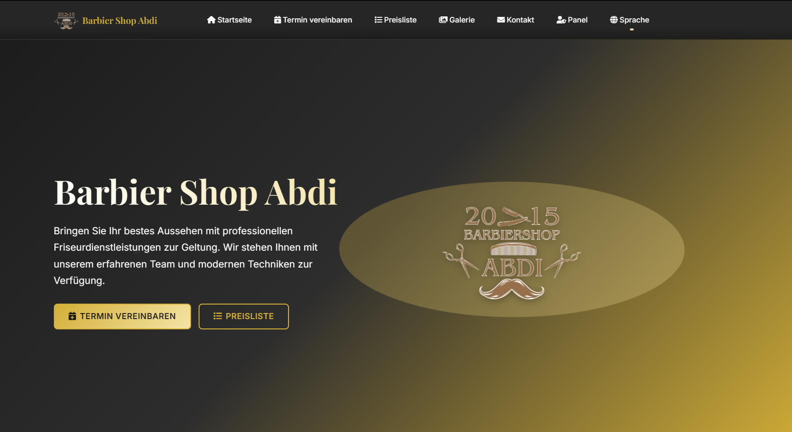
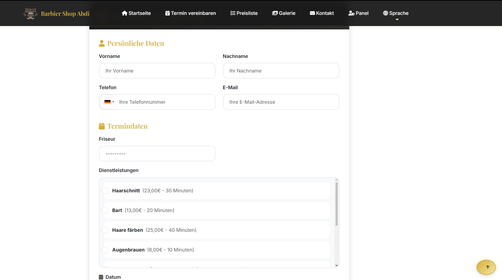
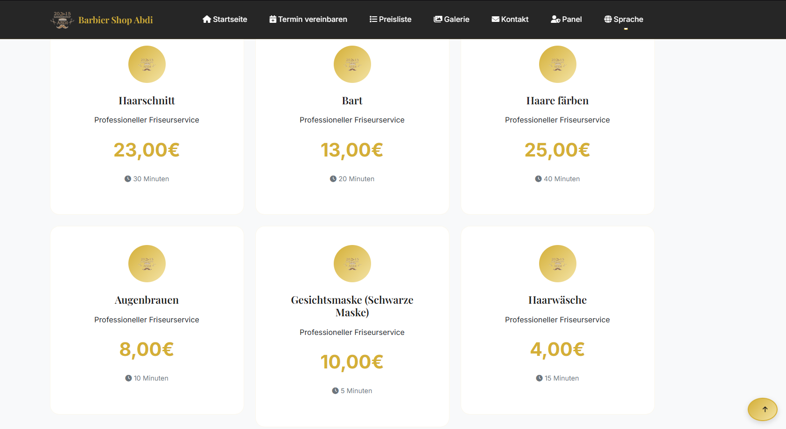
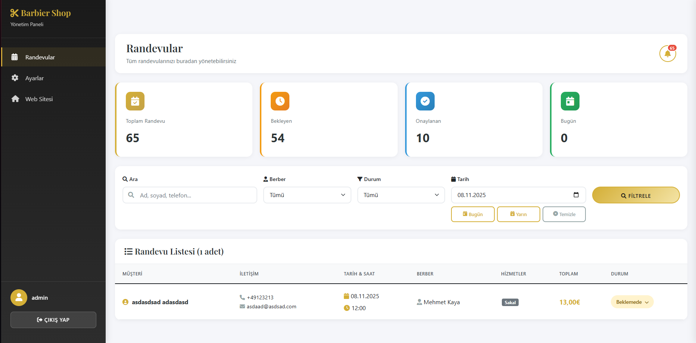

# Berber Randevu Sistemi

Django ile geliştirilmiş, çok dilli berber randevu ve yönetim paneli uygulaması.

## Proje Özeti

`berber-randevu-sistemi`, müşterilerin online randevu alabileceği ve işletmenin randevuları panel üzerinden yönetebileceği bir web uygulamasıdır.

## Özellikler

- Online randevu oluşturma ve uygun saat kontrolü
- Berber panelinden randevu listeleme, filtreleme ve durum güncelleme
- Çoklu hizmet seçimi ve toplam fiyat hesaplama
- İletişim formu ve SMTP üzerinden e-posta bildirimleri
- Çok dilli arayüz desteği (TR/EN/DE)
- Django admin paneli ile içerik ve ayar yönetimi

## Kullanılan Teknolojiler

- Python 3
- Django 5.2
- SQLite (geliştirme ortamı)
- HTML, CSS, JavaScript

## Yerel Kurulum

1. Depoyu klonlayın:
   - `git clone https://github.com/Samet-Batuhan/berber-randevu-sistemi.git`
   - `cd berber-randevu-sistemi`
2. Sanal ortamı oluşturun ve aktif edin:
   - Windows: `python -m venv venv`
   - Windows: `.\\venv\\Scripts\\activate`
3. Bağımlılıkları yükleyin:
   - `pip install -r requirements.txt`
4. Ortam değişkenlerini hazırlayın:
   - `.env.example` dosyasını `.env` olarak kopyalayın
   - Gerekli değerleri kendi bilgilerinizle doldurun
5. Veritabanı migrationlarını uygulayın:
   - `python manage.py migrate`
6. Uygulamayı çalıştırın:
   - `python manage.py runserver`

## Ortam Değişkenleri

Örnek değişkenler `.env.example` dosyasında bulunur.

- `DJANGO_SECRET_KEY`
- `DEBUG`
- `ALLOWED_HOSTS`
- `EMAIL_HOST_USER`
- `EMAIL_HOST_PASSWORD`

## Ekran Görüntüleri

- Ana Sayfa

- Randevu

- Fiyat Listesi

- Admin Paneli

## Güvenlik Notu

Bu repoda gizli bilgi tutulmaz. `SECRET_KEY` ve e-posta SMTP bilgileri ortam değişkenlerinden okunur.

## Lisans

Bu proje `MIT` lisansı ile paylaşılmaktadır. Detaylar için `LICENSE` dosyasına bakabilirsiniz.
